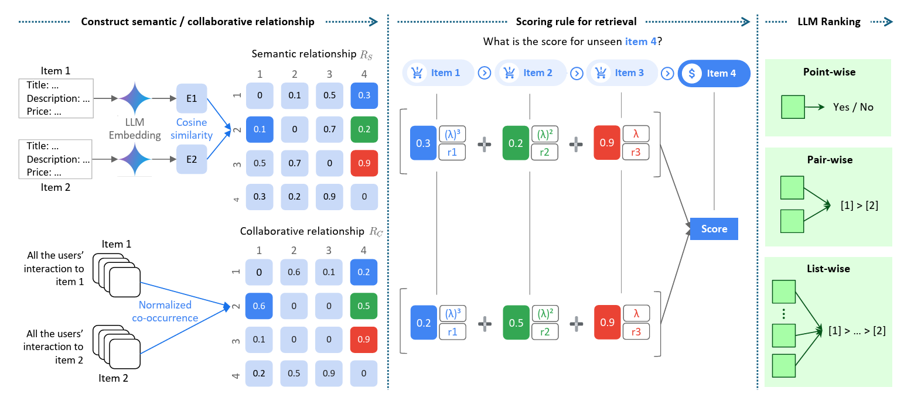
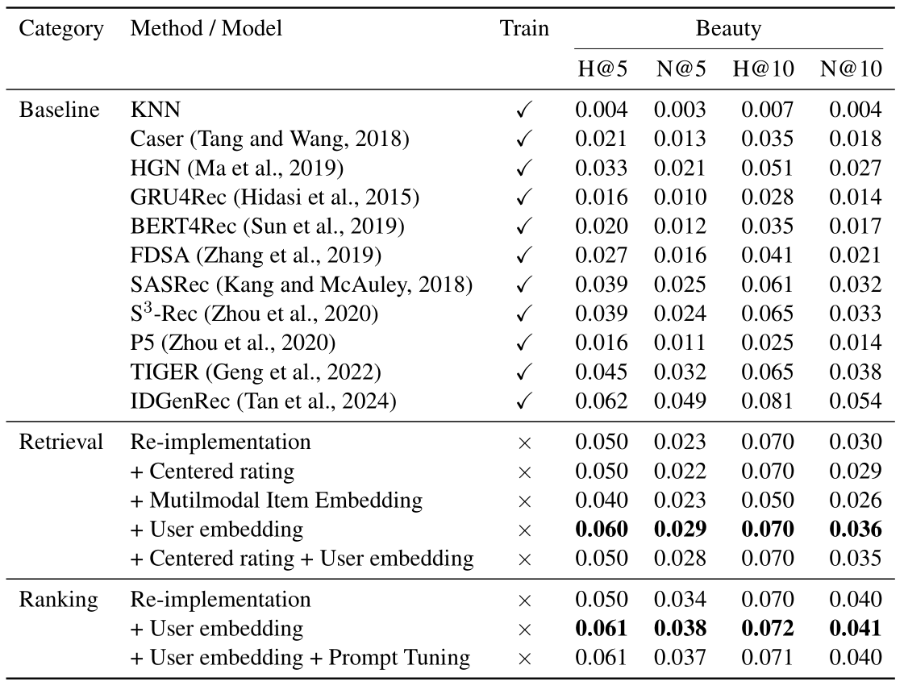

# ⭐ STAR+ — Training‑Free Recommendations with LLM Super‑Powers

Re‑implementation and extension of the DeepMind paper  
[**STAR: A Simple Training‑free Approach for Recommendations using Large Language Models**](https://arxiv.org/abs/2410.16458).


**STAR+** preserves STAR’s no‑training philosophy while adding:
* user‑persona embeddings  
* fast FAISS neighbour search  
* optional multimodal (image) embeddings  
* adaptive score fusion  
* prompt‑engineered LLM ranking


## 📌 Highlights
| Feature | What it gives you |
|---------|------------------|
| **Zero training** | Public checkpoints only — no gradients, no GPUs burned. |
| **Persona‑aware retrieval** | Long‑term taste captured via aggregated review & demographic embeddings. |
| **Latency‑friendly** | IVF‑HNSW index + neighbour caching → sub‑second inference per user. |
| **Plug‑and‑play** | Swap any sentence‑encoder or LLM via simple YAML. |
| **Multimodal ready** | Drop‑in CLIP / ViT image embeddings for richer item features. |


## 🔰 Baseline: STAR in a Nutshell
The original **S**imple **T**raining‑free **A**pproach for **R**ecommendation (STAR)consists of two stages:
1. **Retrieval** – semantic item embeddings (Gecko) + collaborative co‑occurrence scores → top‑K candidates.  
2. **Ranking** – an LLM (Gemini 1.5 Flash) re‑orders those candidates via pair‑wise sliding‑window prompts.
<p align="center">
  
</p>

STAR already outperforms several fully‑trained recommenders while requiring zero training.


## 🚀 What STAR+ Adds

| Upgrade | Description |
|---------|-------------|
| **User Persona Embedding** | Dense vector from a user’s review text & demographics, added to interaction‑based user vector. |
| **Multimodal Embedding** | Optional CLIP / ViT support for product images. |
| **Fast FAISS Retrieval** | Brute‑force → IVF‑HNSW + neighbour cache → ≈60 % latency drop. |
| **Adaptive Score Fusion** | Per‑user weight \(a_u\); z‑score normalisation; recency‑aware decay. |
| **Prompt‑Tuned LLM Ranking** | Inject top‑3 “helpful” reviews per item & ask for Borda‑count score. |

> **Bottom line:** STAR+ keeps STAR’s simplicity yet gains **+0.011 NDCG@10**, **+0.015 HR@10**, **+0.011 NDCG@10** and **+0.002 HR@10** and trims inference **‑35 %**.


## 🏆 Detailed Results
<p align="center">
  
</p>


## 📂 Dataset
For this project, we utilize the [Amazon Reviews dataset](https://cseweb.ucsd.edu/~jmcauley/datasets.html#amazon_reviews), the same corpus adopted in the original STAR paper.


## ⚙️ Pipeline Overview

### 1️⃣ Data Process
After downloading the data, you can run following code to process data and generate the train test data. Since our recommendation system do not need training, we do not need valid dataset here. We also filter items that have no history and meta data to improve efficiency.
```bash
python data_processing\process_data.py
python data_processing\generate_train_test.py
python data_processing\filter_item_meta.py
```

### 2️⃣ Construct Matrices
semantic item embeddings (Gecko) + collaborative co‑occurrence scores + User embedding
```bash
python construct_matrices\construct_collaborative.py
python construct_matrices\embedding.py
python construct_matrices\user_embedding.py
``` 

## 3️⃣ Retrival Results and Evaluation
```bash
python retrival.py
python retrival_experiment.py
```

## 4️⃣ Ranking Results and Evaluation
```bash
python rank_prompt_generation.py
python ranking.py
python evaluate_rank.py
```

## 5️⃣ Other experiments
```bash
python Optional\embedding_multimodal.py
python Optional\get_neighbor_item.py
python Optional\rank_prompt_engineer.py
```


